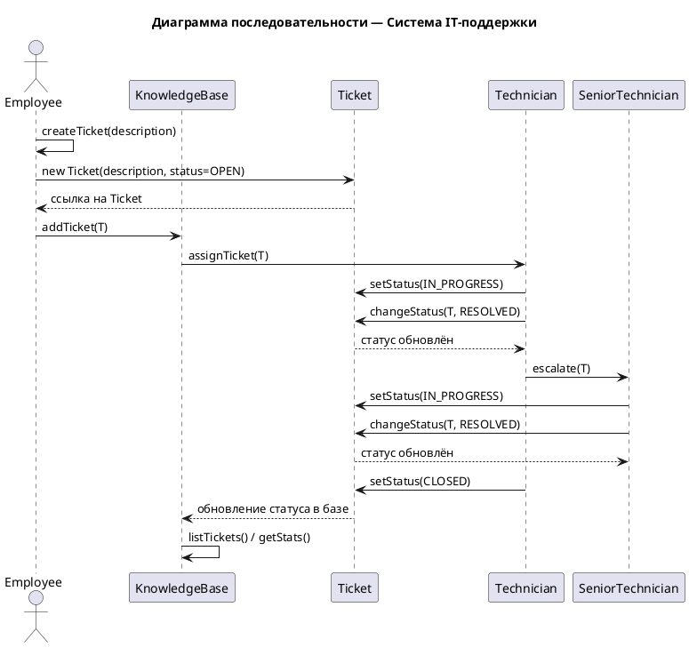

# Лабораторная работа №2: UML Диаграммы взаимодействия 
## Система IT-поддержки (Вариант №8)

---

## UML Диаграмма взаимодействия (Диаграмма последовательности)

## Онлайн версия диаграммы

Диаграмму можно просмотреть онлайн, https://www.planttext.com?text=fLHDQzj04BthLmo-r8AOtWqfmQqfmI4EaUYr26bnH1N9M1j2Rt5pR0zsI4X8cpGDz0DAYPj6hOZhz2-C_a9_ITzALXsbhHse1ClExkpCUpDlTo6KLaTkh7kQTAKdgCIx7FE0loHR6B_Z7n3_uAkaoqEE-8Al-9m7oJFCXyaB7gaTM37ztDebViDnQaRfkKMpeexYq0L7YFULBpakQPfbow13zVMs5pmLGci3W6kxRSkNL6humQOdd9QeMQ4eaHLIerRqC5txYP3fbdbZHzXhFYpBptPX5XqCuRj1vuPRjgXfTsZ-hnys5B5ZtaTfUdp41xn7C7fynZjyo0V_Fgdb7AboxpVVAjaTOKcHyIWx8hGxRbkwWQyN_Cqg-MAJ_dIR8_HCReJppPNwigwPL2b4HmEwoNDqwrArReGX2r48tgXLoNASSN1Jdq7_26ptq_4zx-KbECNqRMeSSczA4Hgrb0wgZfnXwBRyILgrEYOR2ccalCgBouzNLfiFL-k6CGlOCVVv1B3wc9qg7CIliQ2MNmBUA_uu1TYrvFQQvRV4EByvHyZTN7fKVv2NDqEVQXlYJxQJBa7OdvN-SH-6IPz7Cv1-WeQ03x1w_0urEwCoBeMwLJ6wb6pZTY2OVWkucM2h14LO7eIawfYjJQzamMSMuJp9_r1MTsG7NJZX3xbgRjUD2O7xIqrZ0agfzZe6l3CZl5PH0QLI_Jd1QS3VE1ghJvtqt51coWlBEjsbLfO5XgOj2DzHZ-0l

---

## Описание системы

Система "IT-поддержка" предназначена для управления заявками сотрудников и процессом их обработки специалистами технической поддержки.

Основные сущности системы:

Employee (Сотрудник) — создаёт заявку о технической проблеме.

Technician (Технический специалист) — получает заявку, обрабатывает её и меняет статус.

SeniorTechnician (Старший специалист) — подключается при сложных проблемах и выполняет эскалацию заявки.

Ticket (Заявка) — содержит описание проблемы, статус и информацию о назначенных специалистах.

KnowledgeBase (База знаний) — хранит все заявки и собирает статистику по их обработке.

Status (Перечисление) — определяет текущее состояние заявки: OPEN, IN_PROGRESS, RESOLVED, CLOSED.

---

## Контрольные вопросы и ответы

1. Для чего предназначена диаграмма взаимодействия?

Диаграмма взаимодействия предназначена для описания динамики системы, показывая взаимодействие между различными объектами в определенной последовательности. Она отображает:

Порядок вызовов методов между объектами
Временные зависимости между сообщениями
Поток выполнения операций в системе
Взаимодействие компонентов системы во времени

2. Объясните последовательность построения диаграммы взаимодействия объектов программной системы.

Построение диаграммы взаимодействия включает следующие шаги:

Определение участников взаимодействия (объектов, акторов)
Определение начальной точки взаимодействия
Определение последовательности вызовов между участниками
Указание типов сообщений (синхронные, асинхронные, возвратные)
Добавление условий и альтернативных путей при необходимости
Указание активации и деактивации объектов во время взаимодействия
Добавление заметок и пояснений для лучшего понимания

3. На примере построенной диаграммы последовательностей, расскажите порядок объектов программы.
   
На диаграмме последовательности объекты представлены в следующем порядке:

На диаграмме последовательности объекты расположены в следующем порядке (слева направо):

Employee (Сотрудник) — инициирует создание заявки и взаимодействие с системой.

KnowledgeBase (База знаний) — регистрирует заявку и сохраняет все изменения статуса.

Ticket (Заявка) — центральный объект, который изменяет состояния в зависимости от действий специалистов.

Technician (Технический специалист) — получает заявку, обрабатывает её и изменяет статус.

SeniorTechnician (Старший специалист) — привлекается при необходимости для решения сложных задач и завершает обработку заявки.
