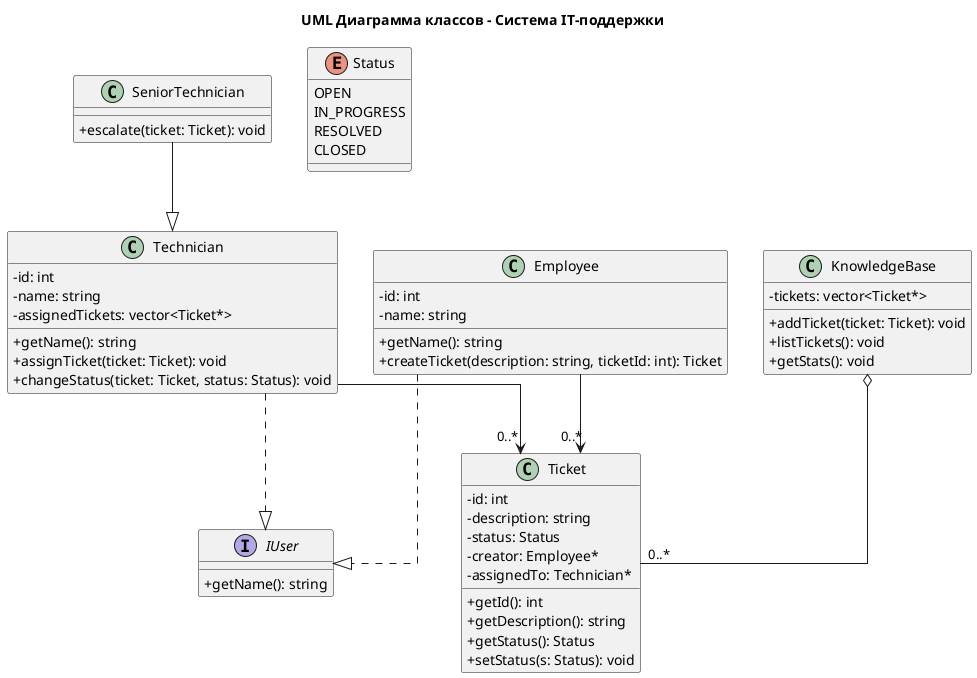

# Лабораторная работа №1: UML Диаграммы классов  
## Система IT-поддержки (Вариант №8)

---

## UML Диаграмма классов

## Онлайн версия диаграммы

Диаграмму можно просмотреть онлайн, https://www.planttext.com?text=ZLLVJnD147-_Jp7fYwLm5HAV6YMeLDE8bD3YgrdlXdR3TRUvtK8GJSHFO8meAXXHttmG_w14fNw5uHivlRlssaA1ksIxCx-PsT_Cx4rdZ1MXRJK2nqeR86IMxiu1lQ13sgVlnqzu_SllFj1l-aFxnvl7czIcR-02xT4XYq_f8C9BLPV-CVI3tmFs-yaEXnd7CIjIDKKe6k05mfZhreRoGSjYoTEg8XyYJFQPY33KQzMwz5OK6WDJmzwtjBAHqzILFiZKXQ_NfAh1iWWCzY61L6ZNcmWwj7NjE59P39U5Xr1QCXZ2XWFyZ4CDxRneO7Qi08RvgPhps76Y4w7OQ0Pw7J6nTK7w1U0uYQJOhUSqAbYizq8K5gkS7DgiZyOBPTDAhRfc4s0Zh1GVmEwnRSgbYbvTIKyATL4sBh2Vh2dqurYc0AleMHrUZUNSz3caO_U4TColoujDLxNqkzdLXQfXnGhRCaE64nooeov037STUtbLK4aTdiXk7BX88k2YZJWvBKoa7b6KKqgT88Eq4cNK9XqMUftF3LTI5_ewaKiBMF8xvUiU7AbcqxDFb9RXf5nZ0nJ6mVIGqJMxe_HQW7uDRmYJNavxTfU5xr-WbO4qDhaksK4aePogcGwgLYCXcT0eBnJdeqrf_lx2OldsOh5IYMJUbEVk5MSZuUPSkS9RZd09hft-C090k_ICPyrRskAfz8wUixHBsxG5bu5_Tka30-_f4w-lsUpp6T6SthUSpp-QZaU0qtVh-hGdRgJhCfRAvvBUOw9Vw1Lj0-qmjPVC_IFG6qwZaymUhpkCPQE1UKJjQ92sUMosMJhYuNim0VILH-ilc1gxK4gkEmsPoNm-b-cEZG7sm-3WzT6kEuGxCwZyph_2Vm00

---

## Описание системы

Система "IT-поддержка" предназначена для управления заявками сотрудников и процессом их обработки специалистами технической поддержки.

Основные сущности системы:

Employee (Сотрудник) — создаёт заявку о технической проблеме.

Technician (Технический специалист) — получает заявку, обрабатывает её и меняет статус.

SeniorTechnician (Старший специалист) — подключается при сложных проблемах и выполняет эскалацию заявки.

Ticket (Заявка) — содержит описание проблемы, статус и информацию о назначенных специалистах.

KnowledgeBase (База знаний) — хранит все заявки и собирает статистику по их обработке.

Status (Перечисление) — определяет текущее состояние заявки: OPEN, IN_PROGRESS, RESOLVED, CLOSED.

---

## Контрольные вопросы и ответы

1. Для чего предназначена диаграмма классов?

Диаграмма классов предназначена для описания структуры системы, отображения классов и отношений между ними. Она показывает:

Структуру классов в системе
Атрибуты и методы классов
Отношения между классами (ассоциации, наследование, реализацию интерфейсов)
Взаимодействие компонентов системы

2. Перечислите основные графические символы, используемые при построении диаграммы классов.

Основные графические символы UML диаграммы классов:

Класс: прямоугольник, разделенный на три секции (имя класса, атрибуты, методы)
Интерфейс: прямоугольник с ключевым словом «interface» или круг с именем интерфейса
Ассоциация: сплошная линия между классами
Агрегация: линия с незакрашенным ромбом
Композиция: линия с закрашенным ромбом
Наследование: сплошная линия с треугольной стрелкой
Реализация интерфейса: пунктирная линия с треугольной стрелкой
Зависимость: пунктирная линия со стрелкой

3. Как на диаграмме классов представляются отношения наследования и агрегации?

Наследование представляется сплошной линией с треугольной стрелкой, направленной от подкласса к базовому классу. Стрелка указывает на базовый класс.

Агрегация представляется сплошной линией с незакрашенным ромбом на конце, указывающем на целое. Агрегация показывает отношение "часть-целое", где части могут существовать независимо от целого.

